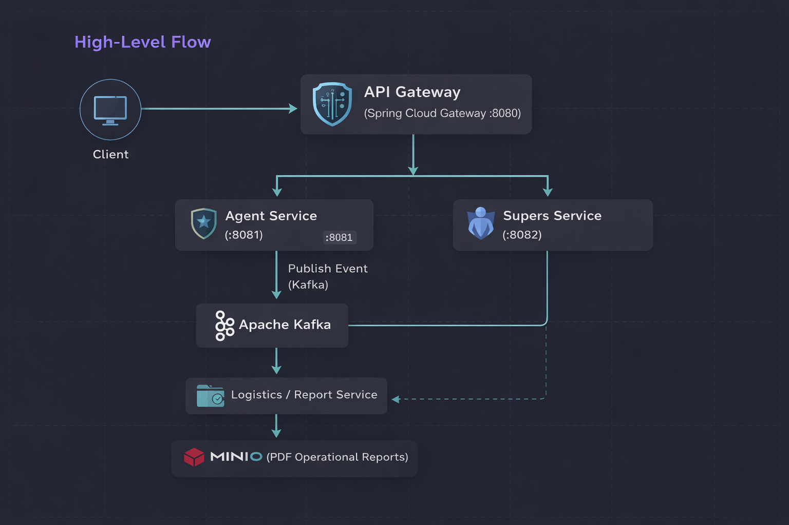

# Overwatch Intelligence System

A distributed system based on **microservices architecture**, designed to manage agents, enhanced individuals (supers), and strategic operational reports.

The project simulates a **military/government intelligence environment**, where agents are operationally linked to supers, events are propagated asynchronously, and official reports are generated and stored securely.

This system was built with **scalability, decoupling, and real-world architectural practices** in mind.

---

# Project Purpose

- Manage intelligence agents and their operational status
- Register and control enhanced individuals (supers)
- Publish consolidated intelligence events using **Apache Kafka**
- Generate professional operational reports asynchronously
- Store classified reports using object storage (**MinIO**)
- **API Gateway:** Spring Cloud Gateway


---

# Architecture Overview

- **Architecture:** Microservices
- **Synchronous Communication:** REST (HTTP)
- **Asynchronous Communication:** Apache Kafka
- **Persistence:** MySQL
- **File Storage:** MinIO (S3-compatible)
- **Infrastructure:** Docker & Docker Compose

# High-Level Flow



This diagram illustrates the high-level interaction between clients, API Gateway,
microservices, event-driven processing with Kafka, and operational report storage
using MinIO.


---

# Security & Identity Management (Spring Security + Keycloak)

The system uses Keycloak as an external Identity and Access Management (IAM) solution, integrated with Spring Security to provide authentication and authorization based on JWT (OAuth 2.0 / OpenID Connect).

This approach follows enterprise-grade security practices, separating identity concerns from business logic

## Authentication Flow

- The client authenticates with Keycloak
- Keycloak issues a JWT access token
- The token is sent in requests via the Authorization: Bearer <token> header
- Each protected microservice validates the token independently
- Access is granted or denied based on mapped roles

> The API Gateway forwards requests but does not own authorization logic.

---

## Role-Based Authorization

Authorization is enforced at the microservice level, using Spring Security with role-based access control.

### Defined roles:

- AGENT
- DIRECTOR

Example access rules:

> GET /agent/** → AGENT or DIRECTOR
> POST /agent/** → DIRECTOR only
> PUT /agent/** → DIRECTOR only
> DELETE /agent/** → DIRECTOR only

---
# JWT Role Mapping

Keycloak roles are extracted from client roles and mapped into Spring Security authorities using a custom JwtAuthenticationConverter

## This ensures:

- Correct translation of Keycloak roles into Spring Security authorities, respecting the expected format (ROLE_* when required)
- Consistent authorization behavior across endpoints, avoiding mismatches between token claims and security rules
- Explicit control over how authorization data is interpreted by the application, instead of relying on Spring Security’s default claim resolution
---
# Security Design Principles

- Each microservice validates JWT tokens independently
- No trust is placed on upstream services for authorization
- Roles are managed centrally in Keycloak
- Services remain stateless and scalable
- Clean separation between:
  - Identity (Keycloak)
  - Authorization (Spring Security)
  - Routing (API Gateway)
---

# Microservices Breakdown

### API Gateway — `:8080`

The API Gateway acts as the single entry point for the system, centralizing access to all microservices.

### Responsibilities
- Route external requests to internal microservices
- Centralize API exposure
- Abstract internal service ports from clients
- Prepare the system for future concerns such as authentication, authorization and rate limiting

### Routing Overview
- `/agent/**` → Agent Service (`:8081`)
- `/supers/**` → Supers Service (`:8082`)

All external clients must interact **exclusively through the Gateway**.


### Agent Service — `:8081`
> This service is accessed externally through the API Gateway.


**Responsibilities**
- Agent lifecycle management
- Association between agents and supers
- Publishing intelligence events to Kafka

#### Endpoints

**Create Agent**


```json
{
  "name": "Nick Fury",
  "agentRole": "DIRECTOR",
  "dateOfBirth": "1950-07-04",
  "agentCode": "DIR-001",
  "superId": 2
}
```
 - #### superId represents the associated enhanced individual.

### **List Agents**

### GET /agent

---
### **Update Agent**

### PUT /agent/{agentCode}

---
### **Deactivate Agent (Soft Delete)**

### DELETE /agent/{id}

---

### **Reactivate Agent**

### POST /agent/{id}/enable

---

### **Publish Intelligence Event (Kafka)**

### POST /agent/{id}/supers/{superId}/publish

---

## **This operation**:

 - Loads the agent from the database

 - Retrieves super data via OpenFeign

 - Consolidates agent + super data

 - Publishes a structured event to Kafka

---

# Supers Service — `:8082`
> This service is accessed externally through the API Gateway.


# Responsibilities

* Registration of enhanced individuals
* Threat level classification
* Ability management
* Soft delete with reactivation

---
#### Endpoints

**Create Super**

### POST /supers


```json
{
  "name": "Gambit",
  "dateOfBirth": "1968-01-01",
  "superCode": "GMBT01",
  "abilities": [
    "Energy Charge",
    "Agility",
    "Card Throwing"
  ],
  "threatLevel": "HIGH"
}
```
**List Supers**

### GET /supers

---

**Get Super by ID**

### GET /supers/{id}

---

**Update Super**

### PUT /supers/{superCode}

---

**Deactivate Super (Soft Delete)**

### DELETE /supers/{superCode}

---

**Reactivate Super**

### POST /supers/{superCode}/enable

---

# Bucket Service — `:8083`(Internal) 

## Internal service used exclusively by other microservices.

### Responsibilities

* File upload
* Secure URL generation

---

#  Event-Driven Communication (Kafka)

* **Publisher**: Agent Service
* **Subscriber**: Logistics / report Service

## Published Events Include

* Agent data
* Super data
* Abilities
* Threat level classification

## Subscriber Responsibilities

* Consume the event
* Generate a professional operational report (PDF)
* Store the document in MinIO
* Optionally publish a follow-up event

---

#  Infrastructure (Docker)

## Spring Cloud Gateway

- Runs on port **8080**
- Acts as the single entry point for the system
- Routes requests to Agent and Supers services

## Apache Kafka + Zookeeper + Kafka UI

```yaml
version: '3.9'

services:
  zookeeper:
    image: confluentinc/cp-zookeeper:7.9.4
    depends_on:
      - zookeeper
    environment:
      ZOOKEEPER_CLIENT_PORT: 2181
      ZOOKEEPER_TICK_TIME: 2000
    ports:
      - "2181:2181"

  kafka:
    image: confluentinc/cp-kafka:7.9.4
    environment:
      KAFKA_BROKER_ID: 1
      KAFKA_ZOOKEEPER_CONNECT: zookeeper:2181
      KAFKA_ADVERTISED_LISTENERS: PLAINTEXT://kafka:9092,PLAINTEXT_HOST://localhost:29092
      KAFKA_LISTENER_SECURITY_PROTOCOL_MAP: PLAINTEXT:PLAINTEXT,PLAINTEXT_HOST:PLAINTEXT
      KAFKA_INTER_BROKER_LISTENER_NAME: PLAINTEXT
      KAFKA_OFFSETS_TOPIC_REPLICATION_FACTOR: 1
    ports:
      - "29092:29092"

  kafka-ui:
    image: provectuslabs/kafka-ui
    depends_on:
      - kafka
    environment:
      KAFKA_CLUSTERS_0_NAME: local
      KAFKA_CLUSTERS_0_BOOTSTRAPSERVERS: kafka:9092
      KAFKA_CLUSTERS_0_ZOOKEEPER: zookeeper:2181
    ports:
      - "8090:8080"

```

# MinIO (Object Storage)

```yaml
services:
  minio:
    image: minio/minio
    ports:
      - "9000:9000"
      - "9001:9001"
    environment:
      MINIO_ROOT_USER: admin
      MINIO_ROOT_PASSWORD: admin123
```

# MySQL
```yaml
services:
  mysql:
    image: mysql:8.0
    container_name: db_overwatch
    environment:
      MYSQL_ROOT_PASSWORD: root123
      MYSQL_USER: nickFury123
      MYSQL_PASSWORD: nickFuryShield123
    ports:
      - "3306:3306"
```

---

#  Database Initialization (Mandatory)

##  Must be executed before starting the application

## Supers Tables

```sql
create table tb_supers (
  id bigint primary key auto_increment,
  name varchar(100) not null,
  date_of_birth date,
  super_code varchar(50) unique not null,
  url_report text,
  threat_level enum('LOW','MODERATE','HIGH','SEVERE','CRITICAL'),
  active boolean
);

create table tb_super_abilities (
  super_id bigint not null,
  ability varchar(255) not null,
  foreign key (super_id) references tb_supers(id)
);
```

## Agents Table

```sql
create table tb_agent (
id bigint auto_increment primary key,
name varchar(100),
date_of_birth date,
agent_code varchar(50),
super_id bigint,
agent_role enum('AGENT','DIRECTOR','FIELD_AGENT'),
active boolean
);
```

---

# Architectural Decisions & Technical Challenges

## 1. Decoupling Domain and Messaging Models

Kafka events use dedicated representation models, avoiding entity leakage and preventing tight coupling between services.

## 2. Event-Driven Report Generation

Report creation is asynchronous, ensuring:

* Non-blocking API operations
* Scalability under load
* Clear separation of responsibilities

## 3. Soft Delete Strategy

Agents and supers are never physically removed, preserving:

* Historical integrity
* Audit capability
* Government-grade traceability

## 4. OpenFeign for Controlled Synchronous Calls
Feign is used only where strong consistency is required, avoiding unnecessary service-to-service chatter

## 5. Object Storage over File System

MinIO was chosen to simulate enterprise-grade object storage, aligning with real-world cloud architectures.

---

## Next Steps

* API documentation using Swagger / OpenAPI
* Advanced validation and contract testing
---

# Author

## Lucas Bandeira

Backend Developer — Java & Distributed Systems
Focused on clean architecture, scalability, and real-world solutions
